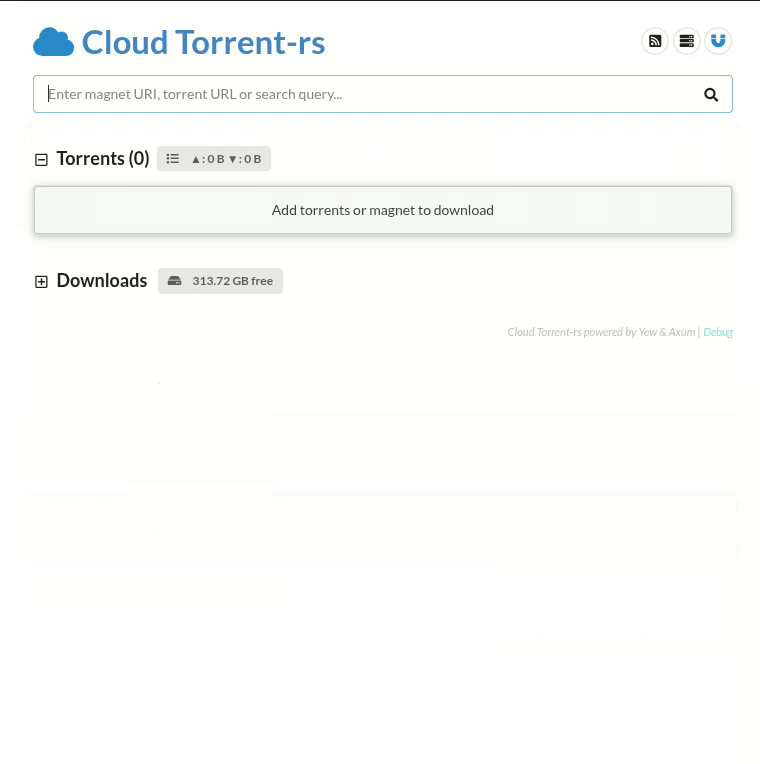

# Cloud Torrent-rs



[](https://github.com/OctopusTakopi/cloud-torrent-rs/actions/workflows/build-release.yml)
[](https://hub.docker.com/r/octopustakopi/cloud-torrent-rs/)

**Cloud Torrent-rs** is a self-hosted remote torrent client rewritten in Rust. Start torrents remotely, download files to the server's local disk, then retrieve or stream them over HTTP from any browser.

Built on top of [librqbit](https://github.com/ikatson/rqbit) and [Axum](https://github.com/tokio-rs/axum), with a [Yew](https://yew.rs) frontend.

This project is a Rust reimplementation of [SimpleTorrent](https://github.com/boypt/simple-torrent) / [cloud-torrent](https://github.com/jpillora/cloud-torrent).

---

## Why cloud-torrent-rs?

The original Go-based implementations of Cloud-Torrent and Simple-Torrent frequently suffer from race conditions and crashes and internal state corruption.

**Cloud-Torrent-rs** was built to solve this:

- **Rust Reliability**: Leverages Rust's memory safety and strict ownership model to eliminate data races and common crash patterns.
- **Modern Core**: Built on [librqbit](https://github.com/ikatson/rqbit), a modern, high-performance BitTorrent engine.
- **Improved Stability**: Designed for 24/7 self-hosting with predictable memory usage and robust error handling.

---

## Features

- **Real-time web UI** — live torrent stats pushed via Server-Sent Events and WebSocket
- **Basic HTTP Authentication** — protect your instance with `--auth user:password`
- **TLS / HTTPS** — native TLS via Rustls, no C dependencies (`--cert-path` / `--key-path`)
- **Unix Domain Socket** — listen on a socket file instead of TCP (`--listen unix:/run/ct.sock`)
- **Download control** — per-file download and seeding control
- **Torrent watcher** — watches a directory for `.torrent` files and auto-adds them
- **Speed limits** — configurable upload/download rate limits
- **Seed ratio / seed time** — auto-stop seeding after a threshold
- **External tracker lists** — fetch and merge tracker lists from remote URLs
- **Magnet RSS** — subscribe to RSS feeds of magnet links
- **Embedded torrent search** — built-in scraper with configurable search providers
- **Done command** — run a shell command when a torrent completes
- **Docker & docker-compose** ready — multi-arch images (`linux/amd64`, `linux/arm64`)
- **Single static binary** — no runtime dependencies (musl build available)

---

## Install

### Quick Install (Linux with systemd)

```bash
bash <(wget -qO- https://raw.githubusercontent.com/OctopusTakopi/cloud-torrent-rs/master/scripts/quickinstall.sh)
```

To install a specific version:

```bash
bash <(wget -qO- https://raw.githubusercontent.com/OctopusTakopi/cloud-torrent-rs/master/scripts/quickinstall.sh) v1.0.8
```

The script installs the binary to `/usr/local/bin/cloud-torrent` and registers a systemd service.
Read more: [Auth And Security](https://github.com/OctopusTakopi/cloud-torrent-rs/wiki/AuthSecurity)

### Binary

Download a pre-built binary from the [latest release](https://github.com/OctopusTakopi/cloud-torrent-rs/releases/latest).

| Platform              | Binary                                  |
| --------------------- | --------------------------------------- |
| Linux x86_64 (static) | `cloud-torrent_linux_amd64_static.gz` |
| Linux ARM64           | `cloud-torrent_linux_arm64.gz`        |
| Windows x86_64        | `cloud-torrent_windows_amd64.exe.gz`  |

### Docker

```bash
docker run -d \
  -p 3000:3000 \
  -p 50007:50007 \
  -v /path/to/downloads:/app/downloads \
  -v /path/to/cloud-torrent.yaml:/app/cloud-torrent.yaml \
  octopustakopi/cloud-torrent-rs:latest
```

> **Tip:** Add `--net=host` to enable UPnP automatic port forwarding.

See the full docker-compose setup: [DockerCompose wiki](https://github.com/OctopusTakopi/cloud-torrent-rs/wiki/DockerCompose)

### Build from Source

**Requirements:** Rust (stable), [trunk](https://trunkrs.dev/)

```bash
git clone https://github.com/OctopusTakopi/cloud-torrent-rs.git
cd cloud-torrent-rs

# Build the Yew frontend
cd frontend && trunk build --release && cd ..

# Build the backend binary
cargo build --release

# Or use the release script (cross-compiles, compresses)
bash scripts/make_release.sh linux amd64 static gzip
```

---

## Usage

```
cloud-torrent [OPTIONS]

Options:
  -l, --listen <LISTEN>              Listen address or unix socket  [env: LISTEN=]  [default: 0.0.0.0:3000]
  -t, --title <TITLE>                Instance title  [env: TITLE=]  [default: Cloud Torrent-rs]
  -d, --download-dir <DOWNLOAD_DIR>  Download directory  [env: DOWNLOAD_DIR=]  [default: downloads]
      --auth <AUTH>                  Basic auth credentials 'user:password'  [env: AUTH=]
  -r, --cert-path <CERT_PATH>        TLS certificate file  [env: CERT_PATH=]
  -k, --key-path <KEY_PATH>          TLS private key file  [env: KEY_PATH=]
  -u, --unix-perm <UNIX_PERM>        Unix socket file permissions  [env: UNIX_PERM=]  [default: 0666]
  -h, --help                         Print help
  -V, --version                      Print version
```

All options can also be set via **environment variables** — useful for Docker or systemd.

### Examples

```bash
# Basic — listen on port 3000
cloud-torrent --listen 0.0.0.0:3000

# With authentication
cloud-torrent --auth admin:secret

# With TLS
cloud-torrent --cert-path /etc/ssl/cert.pem --key-path /etc/ssl/key.pem

# Unix domain socket (useful behind nginx)
cloud-torrent --listen unix:/run/cloud-torrent/ct.sock --unix-perm 0660
```

See full documentation: [Command-line Options](https://github.com/OctopusTakopi/cloud-torrent-rs/wiki/Command-line-Options)

---

## Configuration

On first run, `cloud-torrent.yaml` is created in the working directory with defaults.
You can edit it directly or change most settings live via the web UI.

See: [Config File wiki](https://github.com/OctopusTakopi/cloud-torrent-rs/wiki/Config-File)

---

## Reverse Proxy

Cloud Torrent-rs works cleanly behind Nginx, Caddy, or Apache2.
See: [Behind WebServer (reverse proxying)](https://github.com/OctopusTakopi/cloud-torrent-rs/wiki/ReverseProxy)

---

## Credits

- [@jpillora](https://github.com/jpillora) for the original [cloud-torrent](https://github.com/jpillora/cloud-torrent)
- [@boypt](https://github.com/boypt) for [SimpleTorrent](https://github.com/boypt/simple-torrent)
- [@ikatson](https://github.com/ikatson) for [librqbit](https://github.com/ikatson/rqbit)
